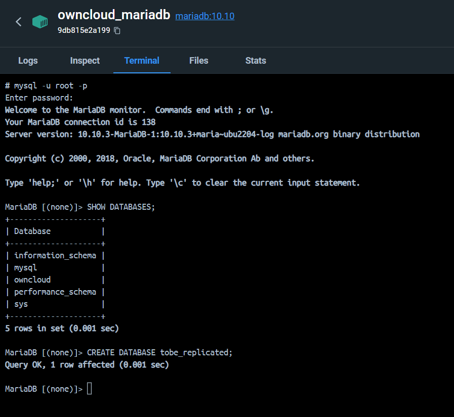

# Práctica 1. Despliegue de servicio ownCloud

## Descripción

En esta práctica se realizarán varios `despliegues del servicio de almacenamiento ownCloud` haciendo uso de microservicios, de manera que cada uno de ellos se encuentre en un contenedor Docker específico.

En particular, haremos uso de los contenedores de [`ownCloud`](https://hub.docker.com/_/owncloud/) (para el servidor de archivos como tal), [`MariaDB`](https://hub.docker.com/_/mariadb/) (base de datos para almacenar la información de los usuarios, como sus nombres, contraseñas, permisos, etc), [`Redis`](https://hub.docker.com/_/redis/) (como capa de caché para mejorar el rendimiento) y [`LDAP`](https://hub.docker.com/r/osixia/openldap/) (para la autenticación de usuarios). Además, se utilizará un contenedor de [`haproxy`](https://hub.docker.com/_/haproxy/) para balancear la carga entre los contenedores de ownCloud en el marco del segundo escenario propuesto.

## Entorno de ejecución

Para la realización de esta práctica se ha utilizado un equipo con sistema operativo `Windows 11 Pro`, `Docker Desktop` en su versión 4.18.0 (104112) y `Docker Engine` en su versión v20.10.24. El equipo en cuestión cuenta con un procesador Intel Core i7-8700K y 32 GB de RAM.

La instalación de Docker Desktop en Windows 11 Pro se ha realizado siguiendo las instrucciones de la [documentación oficial](https://docs.docker.com/desktop/windows/install/). Este proceso habilita `WSL2` como backend de Docker Desktop, el cual ya tenía instalado de antemano. En caso de ser necesario, se puede seguir el [tutorial de Microsoft](https://learn.microsoft.com/es-es/windows/wsl/install) para instalar WSL2, proceso que no cubriré en esta práctica.

Es necesario tener en cuenta que la instalación de `Docker Desktop` en Windows crea dos distribuciones de Linux en WSL2, llamadas `docker-desktop` y `docker-desktop-data`. Será en la segunda donde se almacenan los volúmenes con datos persistentes de los contenedores que creemos, ya que utilizaremos el llamado `driver local` o driver por defecto.

Si usamos las rutas del sistema de ficheros de Windows, los volumenes con los datos se almacenarán en:

```bash
\\wsl.localhost\docker-desktop-data\data\docker\volumes\VOLUME_NAME
```

## Escenario 1: Despliegue de ownCloud simple

Atendiendo a la especificación del primer escenario en el guion de la práctica, se desplegará un servicio `ownCloud` para una pequeña empresa. Así pues, no se hará uso de ningún balanceador de carga, sino que se utilizará un único contenedor de ownCloud para servir las peticiones de los usuarios.

### Fichero de despliegue

Para definir el despliegue de este escenario, se ha creado un fichero `docker-compose.yml`. Iremos comentando cada una de las secciones del mismo a continuación.

En primer lugar, se definen los `volumes` (links entre el almacenamiento en el sistema local y almacenamiento en el contenedor) que se utilizarán en el despliegue. En este caso, se utilizarán cinco volúmenes locales, uno para la base de datos, otro para los datos de `Redis`, otro para los datos que podrá servir `ownCloud` y dos más para el servicio de `LDAP`. Estos volúmenes se crean automáticamente al desplegar el servicio, y se mantienen entre ejecuciones del mismo.

```yaml
version: "3.8"

volumes:
  files:
    driver: local
  mysql:
    driver: local
  redis:
    driver: local
  ldap-data:
    driver: local
  ldap-config:
    driver: local
```

A continuación, deberemos especificar los servicios que serán necesarios para proveer de servicio en este escenario. Comencemos por el servicio de `ownCloud` en sí mismo.

En el siguiente código se especifica la imagen que se debe emplear, el nombre del contenedor, el mapeo de puertos entre host y contenedor (8080 a 8080) y las dependencias. Para que `ownCloud` funcione necesita de `MariaDB`, `Redis` servirá como caché para aumentar el rendimiento y `LDAP` para la autenticación de usuarios.

Además, se especifican las variables de entorno necesarias para que el contenedor de ownCloud sepa cómo conectarse a los servicios de base de datos y caché, así como el nombre de usuario y contraseña del administrador de ownCloud. Se especifica también el comando que se debe ejecutar para comprobar que el servicio está funcionando correctamente y el apartado `volumes` para enlazar almacenamiento en el host y en la carpeta `mnt/data` del contenedor.

Nótese que la mayoría de los valores de las variables de entorno se han definido en el fichero `.env` que se incluye dentro de la carpeta del escenario 1. De esta manera, se puede modificar fácilmente el despliegue sin necesidad de modificar el fichero `docker-compose.yml` en sí mismo.

```yaml
services:
  owncloud:
    image: owncloud/server:${OWNCLOUD_VERSION}
    container_name: owncloud_server
    restart: always
    ports:
      - ${HTTP_PORT}:${HTTP_PORT}
    depends_on:
      - mariadb
      - redis
      - ldap
    environment:
      - OWNCLOUD_DOMAIN=${OWNCLOUD_DOMAIN}
      - OWNCLOUD_TRUSTED_DOMAINS=${OWNCLOUD_TRUSTED_DOMAINS}
      - OWNCLOUD_DB_TYPE=mysql
      - OWNCLOUD_DB_NAME=owncloud
      - OWNCLOUD_DB_USERNAME=${OWNCLOUD_DB_USERNAME}
      - OWNCLOUD_DB_PASSWORD=${OWNCLOUD_DB_PASSWORD}
      - OWNCLOUD_DB_HOST=mariadb
      - OWNCLOUD_ADMIN_USERNAME=${ADMIN_USERNAME}
      - OWNCLOUD_ADMIN_PASSWORD=${ADMIN_PASSWORD}
      - OWNCLOUD_MYSQL_UTF8MB4=true
      - OWNCLOUD_REDIS_ENABLED=true
      - OWNCLOUD_REDIS_HOST=redis
    healthcheck:
      test: ["CMD", "/usr/bin/healthcheck"]
      interval: 30s
      timeout: 10s
      retries: 5
    volumes:
      - files:/mnt/data
```

A continuación, definimos los servicios de base de datos (`MariaDB`) y de caché (`Redis`).

Para el caso del servicio de base de datos `MariaDB` se especifica la imagen de contenedor a utilizar, el nombre del contenedor, las credenciales de acceso y base de datos a emplear. También se especifican algunas opciones de configuración, el comando para comprobar que la base de datos opera sin problemas y el montaje del almacenamiento host-contenedor.

Para `Redis` la configuración es similar, aunque en este caso no se especifica ninguna opción de configuración adicional ni se hace uso de autenticación.

```yaml
  mariadb:
    image: mariadb:${MARIADB_VERSION}
    container_name: owncloud_mariadb
    restart: always
    environment:
      - MYSQL_ROOT_PASSWORD=${MYSQL_ROOT_PASSWORD}
      - MYSQL_USER=${MYSQL_USER}
      - MYSQL_PASSWORD=${MYSQL_PASSWORD}
      - MYSQL_DATABASE=${MYSQL_DATABASE}
    command: ["--max-allowed-packet=128M", "--innodb-log-file-size=64M"]
    healthcheck:
      test: ["CMD", "mysqladmin", "ping", "-u", "root", "--password=${MYSQL_ROOT_PASSWORD}"]
      interval: 10s
      timeout: 5s
      retries: 5
    volumes:
      - mysql:/var/lib/mysql

  redis:
    image: redis:${REDIS_VERSION}
    container_name: owncloud_redis
    restart: always
    command: ["--databases", "1"]
    healthcheck:
      test: ["CMD", "redis-cli", "ping"]
      interval: 10s
      timeout: 5s
      retries: 5
    volumes:
      - redis:/data
```

Finalmente, definimos el servicio de `LDAP` que se utilizará para la autenticación de usuarios. En este punto, es importante destacar algunos detalles:

- Utilizamos una imagen de un tercero, `osixia/openldap`, que nos proporciona un servicio de `LDAP` listo para usar. Esta imagen se encuentra disponible en [Docker Hub](https://hub.docker.com/r/osixia/openldap).
- Se especifica el comando `--copy-service` para que se copien ficheros de configuración de `LDAP` desde el host al contenedor. Junto a la configuración que se mencionará en el siguiente punto, esto permite que los usuarios que tengamos definidos en ficheros .ldif se creen automáticamente en el contenedor de `LDAP` al arrancar.
- Se hace uso de un sexto volumen, `../ldap/ldif`, que enlaza la carpeta donde se encuentran los ficheros con datos de usuario en local con una carpeta concreta del contenedor. El script de arranque del contenedor chequea si hay ficheros .ldif en esta carpeta, y crea los usuarios correspondientes en el servicio de `LDAP`.
- Se hace uso de `LDAP_TLS_VERIFY_CLIENT: never` y el puerto 389 dado que no se va a utilizar TLS (cifrado) en este escenario. En un entorno de producción real, sería recomendable utilizar TLS para la comunicación entre el cliente y el servidor de `LDAP`, de manera que los datos se encuentren cifrados. Esto requeriría de alguna configuración adicional, como el montaje de otro volumen y habilitar el puerto 636.

```yaml
  ldap:
    image: osixia/openldap
    container_name: owncloud_ldap_server
    restart: always
    command: "--copy-service"
    environment:
      LDAP_TLS_VERIFY_CLIENT: never
      LDAP_DOMAIN: ${LDAP_DOMAIN}
      LDAP_BASE_DN: ${LDAP_BASE_DN}
      LDAP_ADMIN_PASSWORD: ${LDAP_ADMIN_PASSWORD}
      LDAP_CONFIG_PASSWORD: ${LDAP_CONFIG_PASSWORD}
      LDAP_READONLY_USER: true
      LDAP_READONLY_USER_USERNAME: readonly
      LDAP_READONLY_USER_PASSWORD: readonly-password
    volumes:
      - ldap-data:/var/lib/sldap
      - ldap-config:/etc/ldap/slapd.d
      - ../ldap/ldif:/container/service/slapd/assets/config/bootstrap/ldif/custom
    ports:
      - "${LDAP_NON_ENCRYPT_PORT}:${LDAP_NON_ENCRYPT_PORT}"
```

### Servicio en funcionamiento

En la carpeta del primer escenario se proporciona un pequeño `Makefile` para facilitar la gestión del despliegue. Para arrancar el servicio, basta con ejecutar el comando `make up` o `make upd`, el cual arrancará el clúster (en primer plano para el caso del primer contenedor, en modo `detach` o segundo plano para el segundo comando). Para detener el servicio, se puede ejecutar el comando `make stop`.

Si arrancamos el clúster y todo ha ido bien, podremos acceder a la interfaz web de `Owncloud` en la dirección `http://localhost:8080` (o la que hayamos especificado en la variable de entorno `HTTP_PORT`).


Podremos iniciar sesión con las credenciales de administrador que hayamos definido en las variables de entorno del fichero `.env`, usadas en el fichero `docker-compose.yml`. En mi caso sería `admin` y `admin`.

De hacerlo correctamente, podremos ver la interfaz de `Owncloud` y los ficheros que crea por defecto.


Llegados a este punto, ya tendríamos el servicio de `ownCloud` funcionando. Sin embargo, y a pesar de que hemos levantado el servidor de `LDAP` para la autenticación de usuarios, todavía no hemos configurado el servicio de `ownCloud` para que utilice dicho servidor.

Para ello, deberemos entrar al `Market` de `ownCloud` e instalar la aplicación `LDAP Integration`. Una vez instalada, accedemos al menú de ajustes del administrador (desde la esquina superior derecha) y buscamos la opción `User Authentication`, donde configuraremos todo lo relativo con la autenticación de usuarios mediante `LDAP`.


En este apartado, deberemos especificar el servidor de `LDAP` que vamos a utilizar, el usuario a emplear y sus credenciales de acceso, así como la base de búsqueda de usuarios. En nuestro caso, el host de `LDAP` a usar viene dado por el nombre del contenedor de `LDAP` que levantamos anteriormente, `owncloud_ldap_server`. El puerto de conexión es el que hemos especificado en la variable de entorno `LDAP_NON_ENCRYPT_PORT` (389), y las credenciales de acceso son las del administrador por defecto. La base de búsqueda de usuarios es la que hemos definido en la variable de entorno `LDAP_BASE_DN`, que en nuestro caso es `dc=modejota,dc=com`.

Si clickamos en `Test Base DN` podremos comprobar si la conexión con el servidor de `LDAP` es correcta y se detectan a los usuarios del mismo. En nuestro caso podemos ver como esta comprobación se realiza con éxito.

Adicionalmente, en el apartado `Users` debemos asegurarnos de que `LDAP Filter` tenga el valor `(objectclass=*)`, ya que vamos a permitir usuarios de cualquier clase. Podría restringuirse mediante el menú desplegable de dicho menú de ser necesario.

En el apartado `Login Attributes` nos aseguraremos de tener marcada la casilla `LDAP / AP Username` y que el campo `LDAP Query` tenga el valor `(&(uid=%uid))`. Esto nos permitirá autenticar a los usuarios mediante su nombre de usuario de LDAP, y no por su nombre completo (CN), o hash generado por `ownCloud`.

Si realizamos una comprobación en el formulario de la parte de abajo con uno de los usuarios que teníamos precargados podremos comprobar que lo detecta correctamente y que la configuración es correcta hasta el momento.


Por último, nos aseguraremos de que el nombre único de los usuarios dentro de `ownCloud` sea el mismo que el de `LDAP`, y no el hash auto-generado por `ownCloud`. Para ello, acudimos a la pestaña `Expert` y dentro del campo `Internal Username Attribute` especificamos `uid`.

Me consta que no todos mis compañeros han necesitado realizar esta configuración, pero en mi caso, como probablemente recuerde de clase, si no realizaba esta configuración no podía compartir correctamente los ficheros entre usuarios ya que no podía usar el nombre de `LDAP` si no el hash generado por `ownCloud`.

Recordemos que cuando se crean los usuarios en `LDAP` la contraseña es generada automáticamente, por lo que en principio no sabemos que credenciales tendremos que usar para acceder a las cuentas de `ownCloud`. Para facilitar el cambio de contraseñas se proporciona en el fichero `Makefile` mencionado anteriormente la orden `change-passwords` que cambia la contraseña de todos los usuarios a su propio nombre de usuario.

Para comprobar que todo funciona, vamos a compartir algunos ficheros entre usuarios. En particular, el usuario `admin` compartirá un fichero a `josealberto`, `alberto` le compartirá un fichero a `jose` y `jose` le compartirá otro fichero a `josealberto`. En las siguientes capturas de pantalla podemos ver como se comparten los ficheros entre los usuarios correctamente desde cada una de las cuentas.


Cabe descatacar que no podremos compartir ficheros entre usuarios que no hayan iniciado sesión al menos una vez. Aunque los usuarios creados en `LDAP` pueden iniciar sesión sin problema alguno, el sistema de `ownCloud` no los lista en el apartado de usuarios (ni en los menús para compartir ficheros) hasta que no han hecho el primer login.

Si acudimos a la ruta:

```bash
\\wsl.localhost\docker-desktop-data\data\docker\volumes\VOLUME_NAME\_data\files\USER_NAME\files
```

podremos ver los ficheros propios de cada usuario. `VOLUME_NAME` se genera a partir del directorio donde se encuentre el fichero `docker-compose` y el nombre del contenedor; en mi caso es `scenario1_files`. Los usuarios pueden ser `admin`, `alberto`, `jose` y `josealberto`.

Si accedemos a la ruta correspodiente a los ficheros del usuario `alberto` podremos ver como contiene la imagen `espm_1600.jpeg` que tenía en propiedad (se puede ver en las capturas anteriores) y los directorios que se crean por defecto. Así también hemos comprobado que la persistencia de datos en la máquina local funciona correctamente.


## Escenario 2: Despliegue con balanceo de carga y replicación de servicios

En este segundo escenario vamos a desplegar una infraestructura de `ownCloud` con balanceo de carga y replicación de servicios (para `ownCloud` y `MariaDB`). Para ello, vamos a utilizar el fichero `docker-compose.yml` que se encuentra en el directorio `scenario2`.

Este fichero es relativamente similar al del escenario anterior, por lo que sólamente destacaremos las diferencias más importantes.

En primer lugar, vamos a añadir el servicio de balanceo de carga, mediante un contenedor de [`haproxy`](https://hub.docker.com/_/haproxy). Este servicio se encargará de distribuir las peticiones de los clientes entre los distintos servidores de `ownCloud` que tengamos levantados.

La configuración de este servicio es bastante simple. Es suficiente con especificar la imagen a utilizar, los puertos a utilizar (80 para peticiones HTTP, 8404 para ver el monitor con estadísticas del balanceador; no se usa puerto 443 ya que no usaremos HTTPS) y definir un volumen para cargar el fichero de configuración del balanceador de carga. Adicionalmente, hemos especificado que el servicio depende del servicio de `ownCloud` para que se dé por levantado después de él.

```yaml
  haproxy:
    image: haproxy:${HAPROXY_VERSION}
    container_name: owncloud_haproxy
    ports:
      - "${HTTP_PORT}:${HTTP_PORT}"
      - "${HAPROXY_STATS_PORT}:${HAPROXY_STATS_PORT}"
    volumes:
      - ./haproxy.cfg:/usr/local/etc/haproxy/haproxy.cfg
    depends_on:
      - owncloud
```

Dentro del fichero `docker-compose.yml` he realizado tres pequeñas modificación en la definición del servicio `ownCloud`. Concretamente:

- Al final del mismo he añadido un bloque `deploy: replicas: 2` para que se lancen dos contenedores de este servicio, consiguiendo esa replicación que buscábamos en este escenario.
- La modificación anterior ha obligado a eliminar el bloque `container_name: owncloud_server`; es ahora Docker quien gestiona el nombre de lo contenedores de este servicio a partir del nombre de la imagen y el número de contenedores levantados. Alternativamente, podríamos haber creado dos servicios de `ownCloud` con nombres de contenedor distintos, pero esto generaría una duplicidad de código y dificultad de mantenimiento innecesaria.
- Se ha eliminado el mapeo de puertos del contenedor al host, ya que ahora el servicio de `ownCloud` sólo será accesible a través del balanceador de carga `haproxy`.

```yaml
  owncloud:
    image: owncloud/server:${OWNCLOUD_VERSION}
    restart: always
    depends_on:
      - mariadb
      - redis
      - ldap
    environment:
      # Se mantiene las variables de entorno del escenario anterior
    healthcheck:
      # Se mantiene el healthcheck del escenario anterior
    volumes:
      - files:/mnt/data
    deploy:
      replicas: 2
```

Para configurar la replicación maestro-esclavo de la base de datos `MariaDB` he utilizado parte del material disponible en [este repositorio](https://github.com/aoki/docker-compose-mariadb-replication). Comentamos el procedimiento seguido a continuación.

Sobre el servicio `MariaDB` original se han añadido dos nuevos volúmenes, desde los que cargar unos ficheros de configuración e inicialización dentro del contenedor.

```yaml
  mariadb:
    # Hasta aquí mantenemos todo igual
    volumes:
      - mysql:/var/lib/mysql
      - ./mariadb-replication/conf/master:/etc/mysql/conf.d/
      - ./mariadb-replication/init/master:/docker-entrypoint-initdb.d
```

El primer fichero `mariadb-replication/conf/master/master.cnf` especifica que se utilice el sistema de logs binario y asigna un identificador único al sistema gestor de base de datos. Este fichero se monta en la ruta correspondiente a la configuración de `MariaDB` dentro del contenedor.

```bash
[mysqld]
log-bin=/var/lib/mysql/bin-log
server-id=1
```

El segundo fichero, `mariadb-replication/init/master/01_replication_setting.sql` contiene sentencias SQL para crear un usuario (que se podrá conectar desde cualquier dirección IP) al que se le otorgan permisos de replicación. El código es batante autoexplicativo.

```sql
CREATE USER 'repl'@'%' IDENTIFIED BY 'repl';
GRANT REPLICATION SLAVE ON *.* TO 'repl'@'%';
```

Configurado el servicio de base de datos maestro, creamos un nuevo servicio de base de datos que actue como esclavo. Para ello, añadimos el correspondiente bloque de código al fichero `docker-compose.yml`.

```yaml
  mariadb-replica:
    image: mariadb:${MARIADB_VERSION}
    container_name: owncloud_mariadb_replica
    restart: always
    environment:
      - MYSQL_ROOT_PASSWORD=${MYSQL_ROOT_PASSWORD}
      - MYSQL_USER=${MYSQL_USER}
      - MYSQL_PASSWORD=${MYSQL_PASSWORD}
      - MYSQL_DATABASE=${MYSQL_DATABASE}
    command: ["--max-allowed-packet=128M", "--innodb-log-file-size=64M"]
    healthcheck:
      test: ["CMD", "mysqladmin", "ping", "-u", "root", "--password=${MYSQL_ROOT_PASSWORD}"]
      interval: 10s
      timeout: 5s
      retries: 5
    volumes:
      - mysql-replica:/var/lib/mysql
      - ./mariadb-replication/conf/replica:/etc/mysql/conf.d/
      - ./mariadb-replication/init/replica:/docker-entrypoint-initdb.d
    depends_on:
      - mariadb
```

Las diferencias respecto del servicio maestro radican en el nombre del contenedor, los volumenes del sistema local que montar en el contenedor y el hecho de que depende del servicio maestro (pues no tiene demasiado sentido que una réplica esclava se ejecute sin su maestro).

El primer fichero de configuración, `mariadb-replication/conf/replica/replica.cnf`, especifica, en este orden, que se debe usar log binario, la ubicación de dicho fichero de logs, la ubicación y el nombre del archivo de índice de registro de retransmisión, que se ignoren los cambios de la base de datos `mysql` y asigna un identificador único al sistema gestor de base de datos (distinto del maestro, obviamente).

```bash
[mysqld]
log-bin=/var/lib/mysql/bin-log
relay-log=/var/lib/mysql/relay-log
relay-log-index=/var/lib/mysql/relay-log
replicate-ignore-db=mysql
server-id=2
```

El segundo fichero de configuración, `mariadb-replication/init/replica/01_replication_setting.sql`, contiene las sentencias SQL necesarias para configurar la réplica esclava. La primera sentencia SQL especifica la dirección IP del servidor maestro (obtenida a partir del nombre del contenedor del servicio maestro), el usuario y la contraseña de la cuenta de replicación. La segunda sentencia inicia la replicación en sí misma.

```sql
CHANGE MASTER TO MASTER_HOST='owncloud_mariadb',
  MASTER_USER='repl',
  MASTER_PASSWORD='repl',
  MASTER_PORT=3306;
START SLAVE;
```

Para comprobar que todo funciona correctamente he realizado un pequeño experimento. He accedido al contenedor del servicio maestro y he creado una base de datos. Después, he accedido al contenedor del servicio esclavo y hemos comprobado que la base de datos creada en el maestro se ha replicado de forma automática en el esclavo. Esto se demuestra en las dos siguientes capturas de pantalla.




Además, podemos comprobar el estado del esclavo mediante la sentencia SQL

  ```sql
  SHOW SLAVE STATUS\G;
  ```
cuyo resultado se muestra en la siguiente captura de pantalla.


Con la configuración anterior ya tenemos todo el clúster funcionando. Sin embargo, aún no hemos configurado el balanceador de carga para que distribuya las peticiones entre los distintos servidores de `ownCloud`. Para ello, vamos a utilizar el fichero `haproxy.cfg`, en el que especificaremos la siguiente configuración:

```bash
defaults
  mode http
  timeout client 10s
  timeout connect 5s
  timeout server 10s
  timeout http-request 10s
  log global

frontend stats
  bind *:8404
  stats enable
  stats uri /
  stats refresh 10s

frontend http-frontend
  bind :80
  default_backend owncloud-servers

backend owncloud-servers
  server owncloud-1 scenario2-owncloud-1:8080 check inter 10s weight 1 fall 2 rise 1
  server owncloud-2 scenario2-owncloud-2:8080 check inter 10s weight 1 fall 2 rise 1
```

En este fichero tenemos 4 secciones, que definen la configuración del balanceador de carga, y que detallamos a continuación:

- `defaults`: Configuración por defecto para todos los servidores. Por orden, especificamos que se use el protocolo HTTP, el tiempo máximo permitido para que un cliente establezca solicitud con el servidor y envíe una petición, el tiempo máximo permitido para que el balanceador establezca conexión con un servidor del backend y envíe una respuesta y el tiempo máximo permitido para que el cliente envíe la solicitud completa.
- `frontend stats`: Configuración del monitor de estadísticas del balanceador de carga. En este caso, se habilita el monitor en el puerto 8404 y se especifica que la ruta para acceder al monitor es `/`. Los datos de estadísticas se refrescan cada 10 segundos.
- `frontend http-frontend`: Configuración del frontend HTTP. En este caso, se especifica que se escuche en el puerto 80 y que todas las peticiones HTTP se envíen al backend `owncloud-servers`.
- `backend owncloud-servers`: Configuración del backend. En este caso, se especifica que se use el algoritmo de balanceo `weight` (que distribuye las peticiones entre los servidores de forma proporcional al peso que se le asigne a cada uno de ellos) y se especifica la lista de servidores que forman parte del backend. En este caso, se especifican dos servidores llamados `owncloud-1` y `owncloud-2`.
Para cada uno de ellos, se especifica la dirección IP (como nombre del contenedor) y el puerto del servidor de `ownCloud` que se va a utilizar. Por último, se especifica que se realice un chequeo de estado cada 10 segundos, que se considere que el servidor está caído si se producen 2 fallos consecutivos y que se considere que el servidor está disponible si se produce 1 éxito consecutivo.

Cabe destacar que existen muchos algoritmos de balanceo, como por ejemplo `roundrobin`, `leastconn` (enviar petición al servidor con menos conexiones activas), `source` (asigna solicitudes a un servidor en función de la IP del cliente), `uri` (asigna solicitud a un servidor u otro en función de una parte específica de la URI), `ip_hash` (asigna solicitud a un servidor u otro en función de la IP del cliente,de manera que a un mismo cliente le atienda siempre el mismo servidor). También existen otras opciones de configuración más avanzadas que no vamos a tratar en este documento.

Tras realizar esta configuración, ya podemos levantar el clúster y comprobar que funciona correctamente. Para ello, ejecutamos el comando `docker-compose up -d` y comprobamos que se levantan los 6 servicios.


Cabe recordar que, dado que estamos utilizando otros volúmenes para la persistencia de datos, se debe replicar la configuración para conectar `ownCloud` y `LDAP` detallada en el escenario anterior. Recordar también ejecutar la orden del `Makefile` para cambiar las contraseñas de los usuarios de `LDAP`.

Si entramos dentro del contenedor `haproxy` podemos ver en los logs cómo detecta correctamente a los dos servidores de `ownCloud` entre los que debe distribuir las peticiones. En un primer momento están caídos, pero cuando se levantan los contenedores de `ownCloud` se detectan y se añaden al balanceo automáticamente.


Para comprobar que el balanceo de carga se realiza de forma correcta, he accedido a la interfaz de monitorización de `haproxy` en el puerto 8404. Después, he cargado unos cuantos ficheros (450 MB aproximadamente) en `ownCloud` y he comprobado cómo se distribuye la carga entre los servidores de `ownCloud`.


Como se puede apreciar en el apartado `bytes` de la tercera tabla de la imagen anterior, la carga se distribuye de forma más o menos equitativa entre los dos servidores de `ownCloud`, recibiendo el primer contenedor unos 221 millones de bytes y proporcionado unos 56.000 como respuesta; mientras que el segundo server recibe unos 239 millones de bytes y sus respuestas ocupan unos 39.000 bytes. También podemos consultar información adicional, como el tiempo que llevan levantados, las sesiones establecidas, peticiones en cola de haberlas, tiempo caídos, etc.

No se adjuntan más capturas de pantalla en lo relativo a subir y compartir ficheros entre usuarios de `ownCloud` porque el funcionamiento es idéntico al del escenario anterior; y de no funcionar no podría haber realizado la prueba anterior.

### Anexo. Intento de escnario 1 en Kubernetes

Tras realizar los dos escenarios haciendo uso de `docker-compose` se intentó replicar el primer escenario haciendo uso de Kubernetes. Para ello, en un primer momento intenté instalarlo dentro de WSL2, para seguir trabajando en el mismo entorno que lo estaba haciendo hasta ahora, pero no fue posible.

Tuve multitud de problemas con la instalación de `minikube`, con la iniacialización de un clúster mediante `kind` y con intentar usar el propio `Kubernetes` que viene instalado junto a `Docker Desktop`. La mayoría de problemas tenían que ver con problemas de mapeo de puertos y acceso a systemctl, que no se podía ejecutar dentro de WSL2.

Por tanto, se decidió realizar la instalación de `minikube` y `kubectl` en el entorno Windows 11 Pro "anfitrión".


Posteriormente, se intentó lanzar el clúster con todos los servicios necesarios para el escenario 1 haciendo uso del fichero `deployment.yaml` que se encuentra en la carpeta `scenario1k` de esta entrega (no se adjunta en este documento dada su considerable extensión). Para ello, se ejecutó el comando `kubectl apply -f deployment.yaml` y se comprobó que se lanzaban todos los pods y servicios.


Aunque todos los pods estaban levantados (MariaDB tomó algo más de tiempo que el resto) y que los servicios estaban funcionando correctamente no se podía acceder a la interfaz de `ownCloud` desde el navegador (ni con la `CLUSTER-IP` ni con `localhost`; ni usando otras opciones en `deployment.yml` para que se usara `NodePort`, ni redirigiendo tráfico como hicimos en la sesión 7, etc). Por mucho que solucionar el problema no fui capaz. Por tanto, no continué con la configuración de `LDAP` (crear usuarios automáticamente)  y la configuración de `ownCloud` para que se conectara a él.

### Bibliografía

- [1. ownCloud Documentation. Installing with Docker](https://doc.owncloud.com/server/next/admin_manual/installation/docker/)
- [2. ownCloud Documentation. LDAP Integration.](https://doc.owncloud.com/server/next/admin_manual/configuration/user/user_auth_ldap.html)
- [3. OpenLDAP container image](https://github.com/osixia/docker-openldap)
- [4. Docker compose sample for replication mariadb](https://github.com/aoki/docker-compose-mariadb-replication)
- [5. Deploy ownCloud on Kubernetes / Swarm - ownCloud conference 2018](https://www.youtube.com/watch?v=yyJHCJu5d0A)
- [6. Apuntes de la asignatura "Servidores Web de Altas Prestaciones" del Grado en Ingeniería Informática de la UGR](https://grados.ugr.es/informatica/pages/infoacademica/guias_docentes/curso_actual/tercero/tecnologiasdelainformacion/servidoreswebdealtasprestaciones)
