# Práctica 2. OpenFaaS.

## Descripción
---

En esta práctica se realizará el desarrollo y despliegue de funciones para la detección de rostros y segmentación de imágenes haciendo uso del software `OpenFaas`, el cual funcionará sobre un clúster de `Kubernetes`.

## Entorno de ejecución
---

Para la realización de esta práctica se ha utilizado un equipo con sistema operativo `Windows 11 Pro`, procesador `Intel Core i7 8700K` y 32 GB de memoria RAM. Para disponer de un entorno `Kubernetes` se hará uso de `minikube` en su versión v1.30.1. Este por debajo hará uso de `Kubernetes` y `Docker` en sus versiones 1.26.3 y 20.10.23 respecticamente.

La instalación de este software se abordó en la [sesión 4 de las prácticas de esta asignatura](https://github.com/ccano/cc2223/tree/main/session4#Kubernetes). Resumidamente, deberemos acudir a la [página web oficial](https://minikube.sigs.k8s.io/docs/start/), descargar el software para el sistema operativo correspondiente e instalarlo (en Windows además deberíamos añadir la ruta del ejecutable al `PATH` del sistema). Hecho esto, ya podremos iniciar nuestro clúster haciendo uso de la orden `minikube start`.

En un principio se intentó instalar sobre `WSL2`, pero se desistió finalmente dado que causaba muchos problemas (parece ser que por no encontrarse `systemd` habilitado, lo que se desaconseja en `WSL2`).

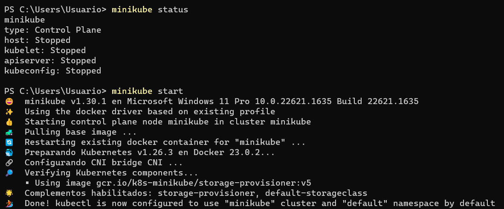

Adicionalmente, necesitaremos instalar `OpenFaaS` encima del clúster de `Kubernetes` creado gracias a `minikube`. Para facilitar la tarea, haremos uso de `arkade`.

La instalación de `arkade` se trató en la [sesión 7 de las prácticas de la asignatura](https://github.com/ccano/cc2223/tree/main/session7#installation-of-arkade-and-openfaas). Más detalles se pueden encontrar en el [repositorio oficial](https://github.com/alexellis/arkade#getting-arkade). En resumen, para instalar `arkade` en una máquina que corre Windows deberemos tener instalado `Git Bash`, abrir una terminal de este programa y ejecutar el comando `curl -sLS https://get.arkade.dev | sh`.

Instalado `arkade`, podemos instalar `OpenFaas` encima suya muy facilmente, sólamente deberemos ejecutar el comando `arkade install openfaas`. En función de lo que queramos desplegar puede que necesitemos alguna opción adicional, esto se tratará más adelante.

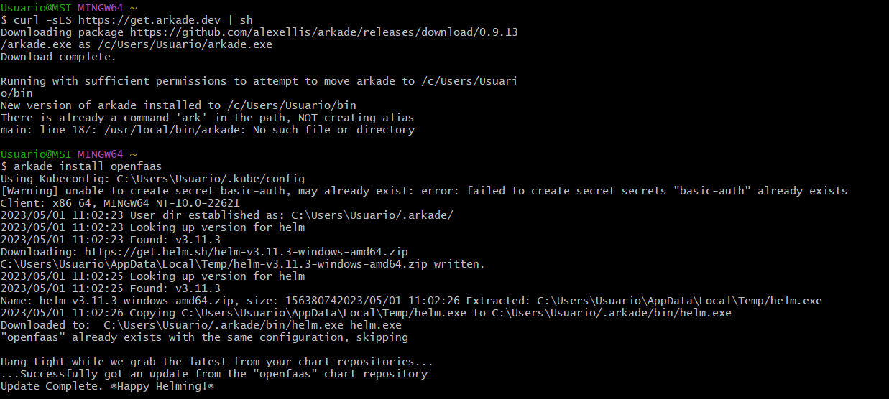

Nótese que ya teníamos el software instalado de cuando realizamos la sesión 7 de prácticas, por lo que se limita a actualizar. Nótese también que instalar `arkade` parece dar errores al mover el ejecutable, pero luego puede usarse sin problema alguno. Para poder disponer de la CLI de `OpenFaaS`, necesitaremos ejecutar el comando `curl -SLsf https://cli.openfaas.com | sh`


A continuación, deberemos establecer el `gateway` con el que comunicarnos "desde nuestra máquina" con el clúster de `Kubernetes`. Para ello, ejecutaremos los dos siguientes comandos:

```bash
kubectl rollout status -n openfaas deploy/gateway

kubectl port-forward -n openfaas svc/gateway 8080:8080 &
```

Posteriormente, deberemos "averiguar" cuáles son las credenciales que tenemos que usar para acceder al panel de administración. Con los comandos que se muestran a continuación establecemos una variable de entorno con la contraseña (extraída de los secretos de `Kubernetes`) e iniciamos sesión en `OpenFaas` mediante mandato a su `CLI`. (Si quisiéramos visualizar la contraseña, la cual necesitaremos para acceder mediante la interfaz web, basta con ejecutar `echo -n $PASSWORD`)

```bash
PASSWORD=$(kubectl get secret -n openfaas basic-auth -o  jsonpath="{.data.basic-auth-password}" | base64 --decode; echo)

echo -n $PASSWORD | faas-cli login --username admin --password-stdin
```

Tras seguir los pasos descritos en este apartado, podemos acceder a la interfaz web, en el puerto 8080 de nuestra máquina local, desde la cual podremos crear y desplegar funciones. Nótese que ya tenemos dos funciones disponibles, aquellas que se usaron a modo de tutorial durante la sesión 7.

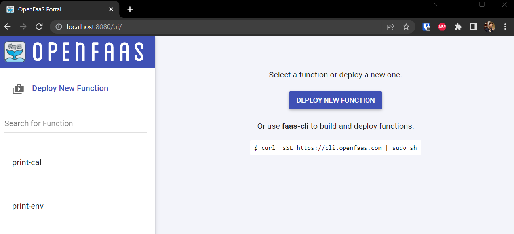

Se adjunta un pequeño script bash llamado `init-faas.sh` con el que realizar la instalación expuesta en este apartado. Este script también desplegará las funciones, como veremos más adelante. Se recomienda ejecutar en segundo plano para que no se imprima en la terminal cada solicitud que se maneje.

## Programa principal
---

Para facilitar el testeo de las funciones desplegadas en el marco de esta práctica se ha desarrollado un pequeño programa Python que pregunta al usuario que función desea ejecutar, el enlace a la imagen que desea procesar y el nombre del archivo donde desea guardar el resultado.

Para los detectores incorporados en la tienda de OpenFaaS el resultado es prácticamente inmediato, tomamos la respuesta de la función y la escribimos en un fichero. Si se hace uso de la web GUI de `OpenFaaS` en la opción Download el fichero se descargará automáticamente.

Para nuestras funciones, se requiere de un pequeño procesado adicional. Esto se debe a que no se ha sido capaz de hacer que la función devuelva la imagen de forma que se "auto-descarge" si usamos la web GUI de `OpenFaaS` con la opción Download. En su lugar, devolvemos una cadena de texto que contiene la imagen codificada en formato base64. Cuando se hace uso de nuestras funciones, el programa Python toma dicha cadena, la descodifica, la convierte en los bytes de la imagen y la guarda en un fichero. Para todo esto se hace uso de los paquetes de Python `base64` y `OpenCV`.

## Despliegue de las funciones
---

### Face Detection with Pigo and OpenCV
---

Comenzaremos desplegando funciones que ya están disponibles en la tienda de `OpenFaas`. Podemos listar todas las disponibles haciendo uso del comando `faas-cli store list`.

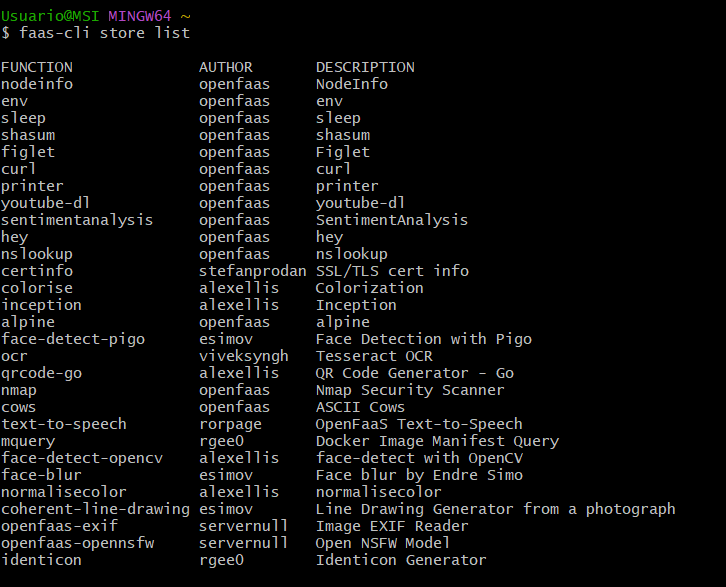

En particular, haremos uso de las funciones `face-detect-pigo` y `face-detect-opencv`. Podemos inspeccionar detalles de las mismas haciendo uso de los comandos `faas-cli store inspect <nombre-funcion>`.

En este caso, podemos ver como ambas toman como entrada una URL (donde debería encontrarse una imagen públicamente accesible) y devuelven la imagen en sí misma, con cajas alrededor de las caras detectadas.

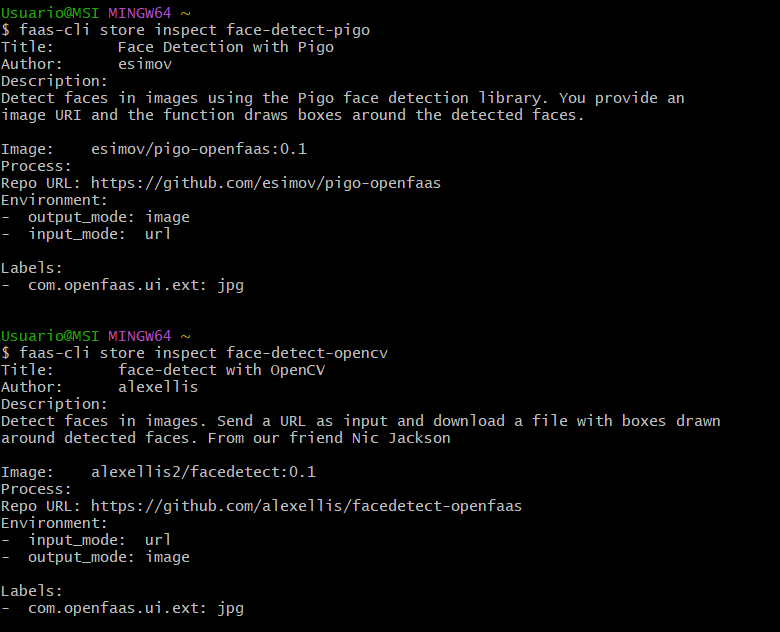

Para probar el funcionamiento de estas funciones, deberemos desplegarlas, para lo que haremos uso de las siguientes órdenes:
```bash
faas-cli store deploy face-detect-pigo

faas-cli store deploy face-detect-opencv
```

Una vez desplegadas, les enviaremos la misma imagen a cada una de ellas para comprobar la calidad de la detección que son capaces de realizar. Esto lo haremos con las siguientes ordenes:

```bash
curl -d https://i.stack.imgur.com/bfZUt.jpg http://127.0.0.1:8080/function/face-detect-pigo -o test-pigo.png

curl -d https://i.stack.imgur.com/bfZUt.jpg http://127.0.0.1:8080/function/face-detect-opencv -o test-opencv.png
```

Hacemos uso de `curl -d` para tomar el enlace a una imagen de Internet y pasarlo a la función que tenemos desplegada. El flag `-o` se utiliza para especificar donde guardar las imágenes que las funciones devuelven como respuesta. Alternativamente, se puede emplear el script Python adjunto.

A continuación, se muestra el resultado de ejecutar ambas funciones sobre una imagen (de alta resolución, 2495x1882) en la que aparecen varios astronaturas posando, siendo las caras plenamente visibles y significativamente distintas al resto del entorno. Se ha elegido esta imagen al ser relativamente similar a la usada como ejemplo en el [repositorio de Pigo para OpenFaas](https://github.com/esimov/pigo-openfaas) y al ser una de las usadas en el [repositorio general de Pigo](https://github.com/esimov/pigo).

En primer lugar, se muestra la imagen devuelta por el detector `Pigo`, siendo la segunda la correspondiente al detector `OpenCV`.

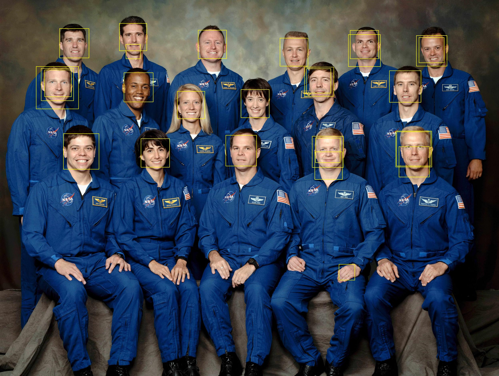


Como se puede comprobar, ninguno de los detectores es perfecto. `Pigo` tiende a detectar varias veces la misma cara con varias bounding boxes, o a partir la cara en dos detecciones (de la boca para arriba, y desde la boca hasta el cuello). También detecta una mano como una cara. Los resultados son bastante peores que los mostrados como ejemplo en los repositorios del autor.

Por su parte, `OpenCV` también divide algunas caras en dos detecciones independientes, y detecta parte de un uniforme como una cara, pero no detecta varias veces la misma cara con diferentes bounding boxes superpuestas. Parece funcionar algo mejor, dentro de lo que cabe.

### Mi función de reconocimiento facial básica
---

En este apartado vamos a desarrollar y desplegar nuestra propia función, en un intento de mejorar los resultados obtenidos por las funciones "disponibles por defecto" utilizadas en el apartado anterior.

Lo primero que deberemos hacer es crear la función en sí misma haciendo uso de la `CLI de OpenFaas`. Para ello haremos uso del comando `faas-cli new --lang python3 basic-face-detection`. En él, especificamos que utilizaremos `Python 3` como lenguaje de programación y que la función se llamará `basic-face-detection`. La ejecución nos devuelve la siguiente salida:

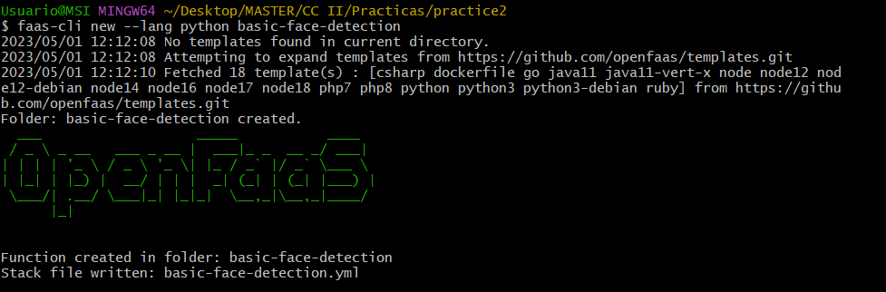

La ejecución del comando anterior crea un fichero `basic-face-detection.yml` con información respecto de cómo construir y desplegar la función, así como un directorio con dos ficheros, en `handler.py` definiremos el código de la función en sí misma, mientras que en `requirements.txt` especificaremos las librerías que requerimos y que por tanto debemos descargar e instalar de antemano (a la hora de construir el contenedor `Docker`).

Una vez hallamos desarrollado nuestra función podremos proceder a desplegarla. Para ello beremos ejecutar los comandos `faas-cli build`, `faas-cli push` y `faas-cli deploy` (con el argumento `-f basic-face-detection.yml`) para construir la imagen del contenedor Docker en el que se ejecutará la función (y en el que se instalarán las dependencias necesarias), subir la imagen a DockerHub (previo inicio de sesión haciendo uso de `echo -n $DOCKER_PASSWORD | docker login --username <user_name> --password-stdin`) y desplegar dicho contenedor con la función dentro del clúster de `Kubernetes`. Para facilitar el trabajo, podemos hacer uso del comando `faas-cli up -f basic-face-detection.yml`. el cual combina los tres órdenes anteriores.

En cualquier caso, necesitaremos modificar el fichero `basic-face-detection.yml`. Si queremos que la imagen `Docker` se publique en DockerHub necesitamos modificar el campo `image` para que se incluya el nombre de usuario. En nuestro caso quedaría como `image: modejota/basic-face-detection:latest`.

Tras probar a desplegar la función comprobamos que es incapaz de instalar `OpenCV` (paquete `opencv-python`), esto es porque la versión "normal" necesita de `Numpy` y no es capaz de encontrar una versión compatible con el sistema que estamos usando (no se puede compilar desde `pip` en un entorno `Alpine Linux`). La solución para este problema es sencilla:

- En primer lugar, dentro del archivo `basic-face-detection.yml` haremos uso del lenguaje `python3-debian` en lugar de `python3`. De esta manera, la imagen base del contenedor será `Debian` en lugar de `Alpine Linux` y podremos instalar `Numpy` sin problemas.
- También deberemos cambiar el paquete de `OpenCV` a instalar. Haremos uso de `opencv-python-headless` que no tiene dependencias con paquetes de GUI y es el indicado para entornos cloud y contenedores Docker.

Con estos cambios, la función se despliega correctamente si ejecutamos `faas-cli up -f basic-face-detection.yml`. A continuación, se muestra el contenido del fichero:

```yaml
version: 1.0
provider:
  name: openfaas
  gateway: http://127.0.0.1:8080
functions:
  basic-face-detection:
    lang: python3-debian
    handler: ./basic-face-detection
    image: modejota/basic-face-detection:latest
```

Si hacemos uso del programa principal descrito anteriormente, al que le pasamos el enlace de la imagen de los astronautas, este es el resultado:


Como se puede observar, los resultados son bastante nefastos. La función divide algunas caras en dos o incluso tres bounding boxes, y detecta como caras partes del uniforme de los astronautas o incluso la tela del asiento. Esta función es la propuesta en el guion de la práctica, y se basa en el uso del algoritmo "Haar Cascades" de `OpenCV`. Dado que el objetivo de la práctica no es el análisis de algoritmos de reconocimiento facial, sino el uso de `OpenFaas`, no vamos a profundizar en el funcionamiento de este algoritmo.

### Mi función de reconocimiento facial con redes neuronales
---

Para mejorar los resultados obtenidos anteriormente, vamos a desarrollar una función que haga uso de redes neuronales para el reconocimiento facial.

Para ello, vamos a hacer uso del módulo de Deep Learning de `OpenCV`. En particular, vamos a utilizar las funciones que nos permiten cargar modelos del framework `Caffe`, desarrollado en la universidad de Berkeley. Se elige esta familia de modelos ya que, aun ejecutándose en CPU, son bastante rápidos y precisos.

Los ficheros que vamos a utilizar son los siguientes:

- `deploy.prototxt.txt`. En él se encuentra la definición de la arquitectura de la red neuronal.

- `res10_300x300_ssd_iter_140000.caffemodel`. En él se encuentran los pesos de la red neuronal. Como su nombre indica, se hace uso de un backbone SSD (Single Shot Detector)

Estos ficheros los colocaremos en la carpeta donde se encuentra el manejador. El Dockerfile por defecto de `OpenFaaS` para Python copia todo lo que esté en esa carpeta al contenedor, por lo que no tendremos que hacer nada más.

No haremos grandes comentarios respecto del código de la función en sí misma, ya que es bastante sencilla. Simplemente destacaremos que, aunque la red está pre-entrenada para imágenes de 300x300 píxeles, se decide usar de entrada 600x600 píxeles, ya que esto permite obtener mejores resultados. Además, se establece el umbral de confianza para considerar una bounding box como válida en el 85%.

Si desplegamos nuestra función haciendo uso del comando `faas-cli up -f cnn-face-detection.yml` y le pasamos la imagen de los astronaturas, obtenemos el siguiente resultado:

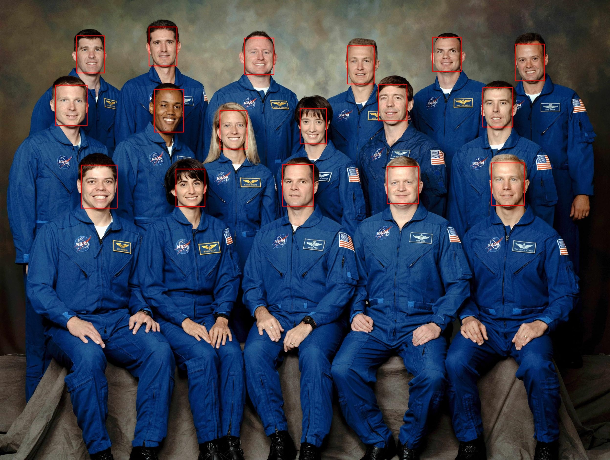

Como se puede apreciar, en esta ocasión obtenemos resultados prácticamente perfectos. Todas las caras son detectadas, no hay varias bounding boxes sobre una misma cara, ni divisiones de una cara en varias cajas ni falsos positivos. Además, las cajas son bastante precisas. Todo ello con un tiempo de ejecución de apenas 1.2 segundos.

### Mis funciones de segmentación de imágenes
---

En este apartado vamos a desarrollar y desplegar una función que haga uso del modelo de aprendizaje profundo `segment-anything` (desarrollado por META). Este modelo es capaz de segmentar imágenes de manera bastante precisa, y es capaz de detectar una gran variedad de objetos.

Se decide emplear este modelo para ilustrar que la lógica y/o procesamiento detras de una "función serverless" pueden ser tan complejos como queramos, en contra de la creencia que uno puede tener al tratar por primera vez con ellas.

Una vez más, crearemos la función Python con el comando `faas-cli new --lang python3-debian sam-segmentation`, modificaremos el nombre del contenedor Docker y especificaremos los paquetes requeridos.

En esta ocasión, requerimos del propio código de META, disponible en [este enlace](https://github.com/facebookresearch/segment-anything.git), PyTorch, OpenCV y Matplotlib.

Además, deberemos descargar el fichero con el modelo concreto a utilizar. Existen tres versiones en función del número de parámetros (B=91 millones, L=308 millones, H=636 millones). Por el momento descargaremos la versión L, ya que no parece haber demasiada diferencia de rendimiento con respecto la versión H pero es algo más rápida.

Deberemos también modificar el fichero YML, el cual queda de la siguiente manera:

```yaml
version: 1.0
provider:
  name: openfaas
  gateway: http://127.0.0.1:8080
functions:
  sam-segmentation-light:
    lang: python3-debian
    handler: ./sam-segmentation-light
    image: modejota/sam-segmentation-light:latest
    environment:
      read_timeout: 600
      write_timeout: 600
      MODEL_FILE: /home/app/function/sam_vit_b_01ec64.pth
```

Nótese que definimos dos variables de entorno para especificar que la función pueda ejecutarse hasta un máximo de 10 minutos antes de ser detenida por `OpenFaas`. Esto lo hacemos porque el modelo es bastante pesado y puede tardar bastante en ejecutarse, como pude comprobar una vez desarrollé la función y la probé "en local". Por defecto, `OpenFaaS` termina la función si no responde en 8 segundos.

Una vez hemos satisfecho todos los pre-requisitos, desarrollamos la función en si misma. Comentemos brevemente el código:

- En primer lugar, cargamos la imagen desde la URL y la convertimos al espacio de color RGB.
  ```python
    img_from_url = urlopen(req)
    img = cv2.imdecode(np.asarray(bytearray(img_from_url.read()), dtype=np.uint8), cv2.IMREAD_COLOR)
    img = cv2.cvtColor(img, cv2.COLOR_BGR2RGB)
  ```
- Posteriormente, creamos una instancia del modelo (versión L) y cargamos los pesos del fichero descargado. También especificamos el dispositivo a utilizar. Dado que `minikube` en Windows no soporta el uso de GPUs, deberemos ejecutarlo en CPU. En caso de usarse en Linux, podríamos especificar el uso de GPU (se requiere habilitar unos determinados plugins, se recomienda seguir [este tutorial](https://minikube.sigs.k8s.io/docs/tutorials/nvidia_gpu/)).
  ```python
    sam = sam_model_registry['vit_l'](checkpoint=os.environ.get('MODEL_FILE'))
    sam.to(device='cpu') # 'cuda' if torch.cuda.is_available() else 'cpu'
  ```
- Creamos un generador de máscaras y le decimos que cree las máscaras (segmentaciones) para la imagen que hemos cargado. Es en este proceso donde se invierte la gran parte del tiempo de computación.
  ```python
    mask_generator = SamAutomaticMaskGenerator(sam)
    masks = mask_generator.generate(img)
  ```
- Usamos las máscaras generadas para colorear los diferentes objetos de forma distinta (y aleatoria); después, codificamos la imagen resultante. Para ello se utiliza el siguiente código:
  ```python
    plt.figure(figsize=(20,20))
    plt.imshow(img)
    if len(masks) != 0:
        sorted_anns = sorted(masks, key=(lambda x: x['area']), reverse=True)
        ax = plt.gca()
        ax.set_autoscale_on(False)

        img = np.ones((sorted_anns[0]['segmentation'].shape[0], sorted_anns[0]['segmentation'].shape[1], 4))
        img[:,:,3] = 0
        for ann in sorted_anns:
            m = ann['segmentation']
            color_mask = np.concatenate([np.random.random(3), [0.35]])
            img[m] = color_mask
        ax.imshow(img)
        plt.axis('off')
        buffer = io.BytesIO()
        plt.savefig(buffer, bbox_inches='tight', pad_inches=0)
        imagen_base64 = base64.b64encode(buffer.getvalue()).decode('utf-8')
  ```
  Nótese que a la hora de salvar la imagen cargamos los datos en un buffer, el cual será procesado para ser convertido a base64 y enviado como respuesta de la función.

Programada la función, decidí ejecutar la función sobre mi equipo "local" para comprobar si funcionaba correctamente. Para la imagen de los astronaturas, de resolución 2495x1882, el tiempo de ejecución fue de unos 170 segundos (algo menos de 3 minutos).

Probado el correcto funcionamiento de la función, procedí a desplegarla en OpenFaaS (previa construcción y publicación del contenedor Docker) con el comando `faas-cli up -f sam-segmentation.yml`. La construcción de dicho contenedor tomó un tiempo considerable y su publicación más aún. Téngase en cuenta que el contenedor de forma local pesa unas 17 GB, mientras que una vez publicado en DockerHub su peso comprimido es de unas 11.5 GB. Además, cada vez que se modifica el código Python se debe reconstruir una capa del contenedor que pesa 7.8 GB aproximadamente, y que hay que volver a subir; de ahí que lo probara bastante en local antes de subirlo.

Además, aunque el contenedor esté disponible de forma local, el proceso de despliegue de la función lo baja del repositorio de DockerHub, por lo que tenemos que sumar el tiempo de descarga y descompresión de los 11.5 GB del contenedor. Este proceso no tiene ningún tipo de retroalimentación al usuario via terminal o web, por lo que puede parecer que no se está realizando. En mi caso, me guié por el monitor del tráfico de red del administrador de tareas para saber cuándo finalizaba la descarga (unos 20 minutos en una red de 100 MB/s cableada).

Tras este tiempo de espera, y algo más en lo que tarda `Kubernetes` en crear el pod, la función estaba disponible. Sin embargo, cuando procedí a probarla, siempre fallaba tras un minuto de ejecución. Esto se debe a que `OpenFaaS` tiene otros límites generales, independientes de los propios de cada función.

Se supone que existe un fichero de configuración desde el que modificar estos valores, pero dado que no lo encontré, reinstalé `OpenFaaS` pasando los nuevos valores como flags al comando de instalación. De esta manera, la orden de instalación de `OpenFaaS` queda de la siguiente manera:

```bash
export TIMEOUT=10m
export HARD_TIMEOUT=10m2s

arkade install openfaas \
    --set gateway.upstreamTimeout=$TIMEOUT \
    --set gateway.writeTimeout=$HARD_TIMEOUT \
    --set gateway.readTimeout=$HARD_TIMEOUT \
    --set faasnetes.writeTimeout=$HARD_TIMEOUT \
    --set faasnetes.readTimeout=$HARD_TIMEOUT \
    --set queueWorker.ackWait=$TIMEOUT
```

Hecho este cambio, la función ya podía ejecutarse más de un minuto sin ser terminada automáticamente. Sin embargo, los problemas no cesaron, dado que cuando llevaba ya un par de minutos de procesamiento, la función se terminaba de forma abrupta devolviendo como respuesta `Internal Server Error. Signal: killed`.

A parte de los límites anteriores, `OpenFaaS` también termina la función si esta agota los recursos que tiene el programa asignado. Estuve mirando si había alguna forma de incrementar los recursos asignados desde algún fichero de configuración, pero no parece posible. Además, me di cuenta de que estaba consumiendo los dos hilos de CPU y 8 GB de RAM asignadas a `minikube` en su totalidad.

Para solucionar este problema tuve que incrementar los recursos asignados a `minikube` a 4 hilos de CPU y 12 GB de RAM. Para ello tuve que detener el clúster, eliminarlo y ejecutar los dos siguientes comandos:

```bash
minikube config set cpus 4
minikube config set memory 12288
```

Tras volverlo a arrancar y replicar todo el proceso de instalación y despliegue explicado hasta el momento, conseguí que la función se ejecutase de forma completa para imágenes de hasta unos 2.5-2.75 millones de píxeles. Para imágenes de mayor resolución la función seguramente siga fallando. De hacer uso de GPU, seguramente esta serie de problemas no tuvieran lugar y no se hubiese necesitado de toda esta configuración adicional.

Para demostrar el correcto funcionamiento del despliegue, se procedió a segmentar dos imágenes de prueba (una habitación y una carretera), para lo que usé el programa principal que se adjunta en la entrega.

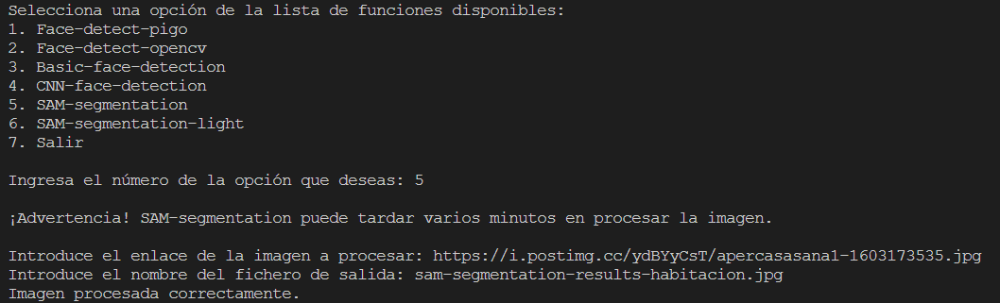

Los resultados obtenidos son los siguientes:

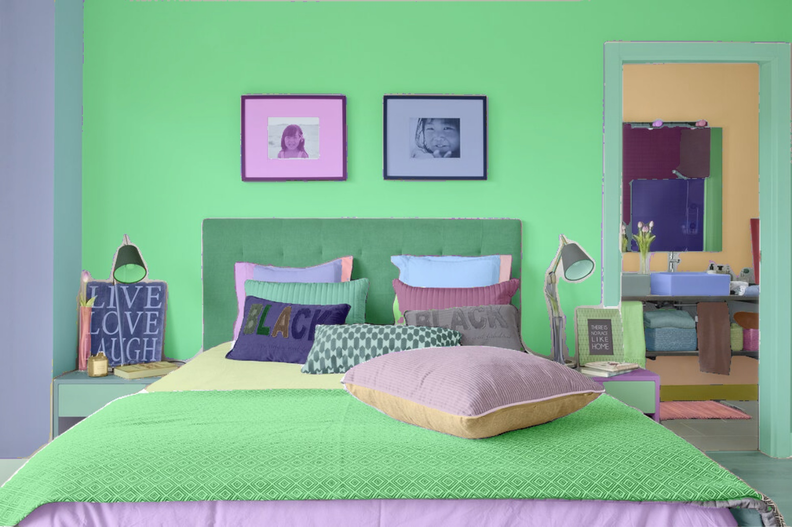
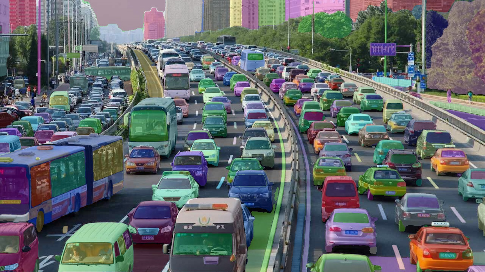

Como se puede apreciar, en el caso de la habitación se segmentan casi todos los objetos (en diferente color) de forma bastante precisa. Para el caso de la carretera se segmentan aparentemente todos los coches, incluso en algunos casos separando las lunas y la carrocería. Para el caso del autobús cercano a la esquina inferior izquierda se segmentan ruedas, varias partes de la luna lateral, la luna frontal y la carrocería. El rendimiento de este modelo de META (en su versión intermedia, hay otra con mayor número de parámetros) es increíblemente bueno.

En la entrega también se adjunta otra función de segmentación de imágenes, cuya única diferencia con la comentada en este apartado es que hace uso del modelo de `segment-anything` de META "pequeño". Se desplegó esta función para ver si se podía conseguir un tiempo de ejecución considerablemente menor, o en su defecto poder procesar imágenes de mayor resolución.

Con respecto del tiempo de ejecución no parece existir grandes diferencias con respecto del modelo "mediano", pero sí que permitió procesar imágenes de mayor tamaño. Se probó a procesar imágenes de hasta 5.2 millones de píxeles (frente a los 2.5 del modelo mediano).

La segmentación de dos imágenes de prueba se muestra a continuación:

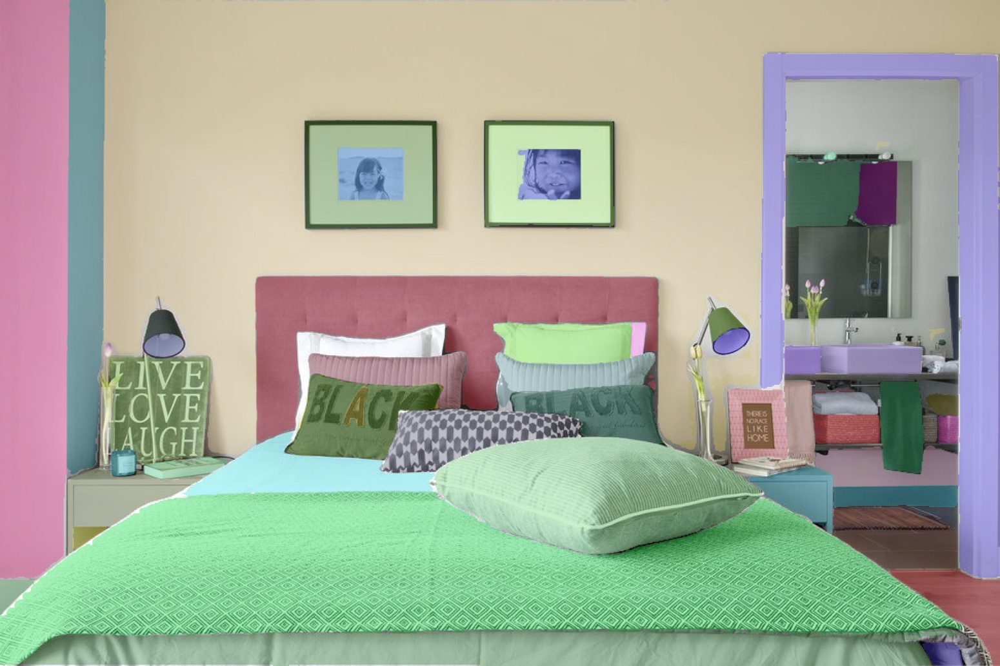
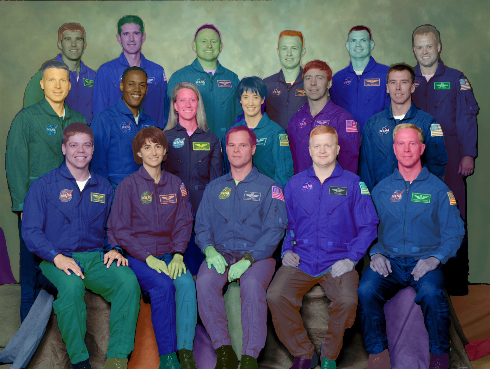

La imagen de la habitación no presenta grandes diferencias respecto de la generada por el modelo mediano, obviando unos bordes más suaves en el lateral de la colcha de la cama. Cabe destacar que el modelo mediano procesó la imagen de la habitación teniendo esta una resolución de 975x650 píxeles, cuatro veces menos que la imagen original (1950x1300 píxeles) que procesó el modelo pequeño.

En el caso de la fotografía de los astronautas separa caras, pelo, manos, chaqueta, pantalones y zapatos con bastante precisión. En ocasiones hasta separa los parches con las banderas de la NASA y USA. Como curiosidad se menciona que esta imagen no pudo ser procesada por la función desplegada en `OpenFaaS` que hace uso del modelo "mediano" dada la falta de recursos, pero sí que pudo ser procesada de forma "local" con dicho modelo, consumiendo cerca de 19 GB de memoria RAM.

En este apartado ha quedado demostrado que podemos implementar funciones tan complejas y exigentes como queramos en `OpenFaaS`, aunque quizás no sea lo común, siempre que realicemos una configuración y asignación de recursos más o menos apropiada.

## Bibliografía
---

- [1. Sesión 4 de las prácticas de la asignatura](https://github.com/ccano/cc2223/blob/main/session4/README.md)
- [2. Sesión 7 de las prácticas de la asignatura](https://github.com/ccano/cc2223/blob/main/session7/README.md)
- [3. Guion de la práctica](https://github.com/ccano/cc2223/blob/main/practice2/REAME.md)
- [4. FaaS-colorization using OpenFaaS and Python](https://github.com/alexellis/faas-colorization)
- [5. Face detection with OpenCV and deep learning](https://pyimagesearch.com/2018/02/26/face-detection-with-opencv-and-deep-learning/)
- [6. Repositorio oficial de Arkade](https://github.com/alexellis/arkade)
- [7. Documentación oficial de Minikube](https://minikube.sigs.k8s.io/docs/start/)
- [8. Repositorio general de Pigo](https://github.com/esimov/pigo)
- [9. Repositorio de Pigo para OpenFaas](https://github.com/esimov/pigo-openfaas)
- [10. Repositorio oficial de Segment-Anything](https://github.com/facebookresearch/segment-anything)
- [11. Start Minikube With More Memory & CPUs](https://www.shellhacks.com/minikube-start-with-more-memory-cpus/)
- [12. Minikube NVIDIA GPU Support](https://minikube.sigs.k8s.io/docs/tutorials/nvidia_gpu/)
- [13. How to Use the Segment Anything Model (SAM)](https://blog.roboflow.com/how-to-use-segment-anything-model-sam/)
- [14. OpenFaaS Expanded Timeouts](https://docs.openfaas.com/tutorials/expanded-timeouts/)
- [15. Computer Vision Models](https://github.com/gopinath-balu/computer_vision/tree/master)
- [16. Caffe software](https://en.wikipedia.org/wiki/Caffe_(software))
- [17. Documentacion de OpenCV](https://docs.opencv.org/4.7.0/)
- [18. Paquetes de OpenCV](https://pypi.org/project/opencv-python/)

## Imágenes
---

- [1. Astronautas](https://i.stack.imgur.com/bfZUt.jpg)
- [2. Carretera con coches](https://noticias.coches.com/wp-content/uploads/2016/03/atasco-china-e1637078496253.jpg)
- [3. Habitación con objetos](https://hips.hearstapps.com/hmg-prod/images/apercasasana1-1603173535.jpg)
